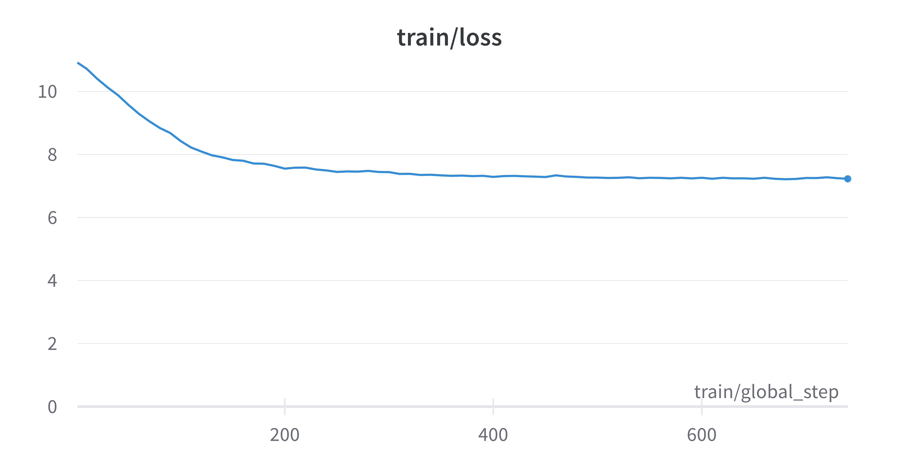

# 0️⃣1️⃣🤗 BitNet-Transformers: Huggingface Transformers Implementation of "BitNet: Scaling 1-bit Transformers for Large Language Models" in pytorch with Llama(2) Architecture


- Paper Link: https://arxiv.org/pdf/2310.11453.pdf

## Prepare Dev env

```bash
# Clone this repo
git clone https://github.com/beomi/bitnet-transformers
cd bitnet-transformers

# Install requirements
pip install -r clm_requirements.txt

# Clone transformers repo
git clone https://github.com/huggingface/transformers
pip install -e transformers

# Update Llama(2) model
rm ./transformers/src/transformers/models/llama/modeling_llama.py
ln -s $(pwd)/bitnet_llama/modeling_llama.py ./transformers/src/transformers/models/llama/modeling_llama.py
```

We'll overwrite `bitnet_llama/modeling_llama.py` into `transformers`. Since the file is linked, any changes made to the file will be reflected in the `transformers` repo.

## Train Wikitext-103



> You can track metrics via wandb

```bash
./train_wikitext.sh
```

## GPU Mem Usage Comparison

**Train Config**

- Batch size: 1
- Gradient accumulation: 1
- Seq length: 2048
- Model: `LLamaForCausalLM` with `BitLinear` layer
- Model size: 110M

**Original LLAMA**

```bash
+-----------------------------------------+----------------------+----------------------+
|   0  NVIDIA H100 PCIe               Off | 00000000:49:00.0 Off |                    0 |
| N/A   62C    P0             302W / 350W |   6637MiB / 81559MiB |     84%      Default |
|                                         |                      |             Disabled |
+-----------------------------------------+----------------------+----------------------+
```

**BitLLAMA - 16bit**

- Use bf16(or fp16) to store model weights
- Use `-1` or `1` for 1-bit weight (but saved with 16bit)
- Use more memory than original LLAMA: It saves 1-bit weight and 16bit weight together

```bash
+-----------------------------------------+----------------------+----------------------+
|   0  NVIDIA H100 PCIe               Off | 00000000:49:00.0 Off |                    0 |
| N/A   52C    P0             248W / 350W |   6905MiB / 81559MiB |     89%      Default |
|                                         |                      |             Disabled |
+-----------------------------------------+----------------------+----------------------+
```

**BitLLAMA - 8bit**

- Use bf16(or fp16) on-the-fly when needed
- Use 8bit to save 1-bit weight

```bash
TBD
```

**BitLLAMA - 1bit**

- Use bf16(or fp16) on-the-fly when needed
- Use 1bit to save 1-bit weight

```bash
TBD
```

## Todo

- [x] Add `BitLinear` layer
- [x] Add `LLamaForCausalLM` model with `BitLinear` layer
    - [x] Update `.save_pretrained` method (for 1-bit weight saving)
- [x] Add sample code for LM training
- [ ] Update `BitLinear` layer to use 1-bit weight
    - [ ] Use uint8 instead of bfloat16
    - [ ] Use custom cuda kernel for 1-bit weight
